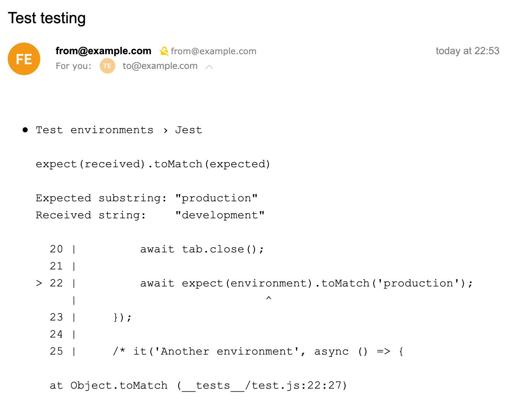

# jest-nodemailer-reporter

<div align="center">
  
  <h1>jest-nodemailer-reporter</h1>
  <p>See jest test errors on e-mail. Nodemail version of <a href="https://github.com/tglink/jest-email-reporter">jest-email-reporter</a> by <b>Anton Karmanov</b></p>
</div>

## Install

```sh
npm install --save-dev jest-nodemailer-reporter
```

## Usage

You must configure the jest config. Do not forget `from` and `to` e-mail addresses.

```javascript
module.exports = {
    ...
    reporters: [
        "default",
        ["jest-nodemailer-reporter", {
            "transporter": {
                "sendmail": true,
                "newline": 'unix',
                "path": '/usr/sbin/sendmail'
            },
            "from": "from@example.com",
            "to": "to@example.com",
            "subject": "Optional subject", // optional
            "reportIfSuccess": true // optional, default is false; it send e-mail message if tests were successful
        }]
    ],
    ...
}
```

## Result


